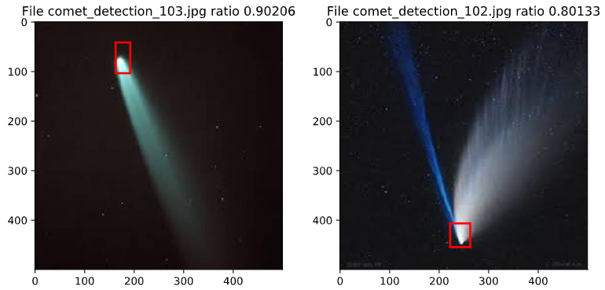
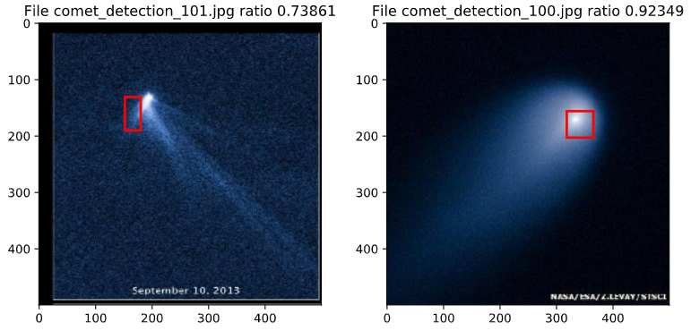
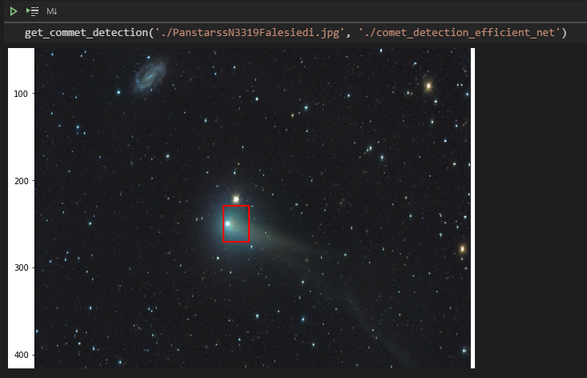

# comet-detection
The goal of this hobby project was to show the possibility of detecting comets in astro images using modern neural network architectures with library pytorch.

# Project steps:
1. With the help of Google, 150 astrographs of comets were found.
2. Using preprocessing procedures (prepare_image_files_to_labels.ipynb), the images were renamed to "image_n.jpg" and convert to the format (3, 500, 500) (channel, width, height).
3. With the help of cvat.org, the bounding boxes were marked. The label was done in 1.5 hours.
4. Using augmentation (https://github.com/albumentations-team/albumentations), increased the dataset to 600 samples.
4. I tested two architectures of the network architecture: 'Resnet-18' and 'Efficientnet'(https://github.com/lukemelas/EfficientNet-PyTorch). The best results were shown by the 'Efficientnet'.
5. Expert knowledge was added to the training process: usually the comment is bright and extended in the image, 
so the average signal level in the bounding box will differ from the average level of the image. 
I create function to calc ratio: avg_signal_bb/ (avg_signal_bb + avg_signal_all_image). And predict ratio in train process.
6. The final training of the neural network took 2.5 hours on my NVideo GTX 2060 video card.

# Recap:

  The model is not perfect, but quite accurately detects the position of the comet in the picture. The model can be improved by increasing the training dataset or by training it on images from one camera. If you have 100-150 comet images, then you can create your own comet detection model, for your camera.

# Further development and proposal for cooperation
The model detects the position of the comet in the image, but cannot classify whether the comet is in the image or not. However, I would like to solve this problem on real astronomical data. Therefore, if you have FITS files with comets and without comets and you are ready to share them, please contact me.

# How to use:
  to detect a comet on your astro image, you will need a file with a trained model (comet_detection_efficient_net) and the function:
  
  '''
  def get_commet_detection(path_to_image, path_to_model):
    import numpy as np
    import matplotlib.pyplot as plt
    from matplotlib import patches
    import torch
    from torchvision.transforms import ToTensor
    from PIL import Image

    pil_img = Image.open(path_to_image).convert('RGB')
    img_resize = pil_img.resize((500,500))

    fig, ax = plt.subplots(figsize = (10,10))
    ax.imshow(img_resize)

    image = ToTensor()(np.array(img_resize))
    image = image.unsqueeze(0)

    model = torch.load(path_to_model).to(device='cpu')
    model.eval()

    predictions = net.to(device='cpu')(image)

    with torch.no_grad():
        x1_y1 = predictions[:, :2]
        x2_y2 = predictions[:, 2:4]

        w = abs(x1_y1[0][0] - x2_y2[0][0]) * img_resize.size[0]
        h = abs(x1_y1[0][1] - x2_y2[0][1]) * img_resize.size[1]
        x = min(x1_y1[0][0],x2_y2[0][0]) * img_resize.size[0]
        y = min(x1_y1[0][1],x2_y2[0][1]) * img_resize.size[1]
        print(x,y,w,h)

    ax.add_patch(patches.Rectangle((x,y),w,h,
                                   fill=False, edgecolor='red', lw=2))

    plt.show()  
  '''

## Example:

